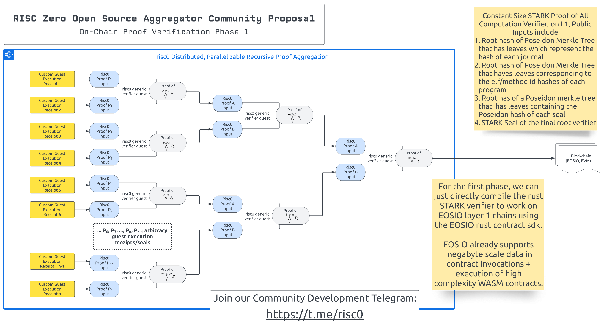
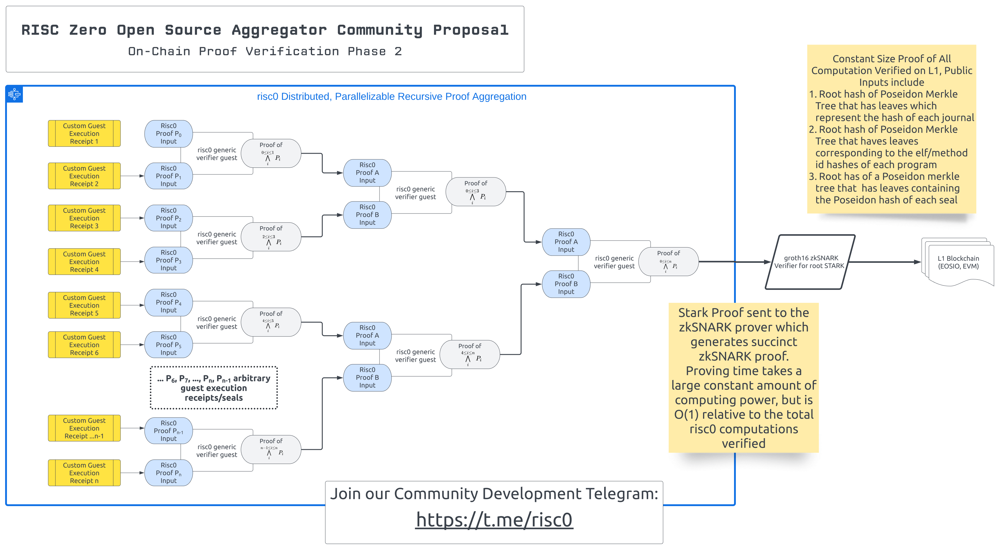

<!-- PROJECT LOGO -->
 

  
   
  <a href="https://github.com/OpenAssetStandards/dr-grouper">
    <picture>
      <source width="60%" media="(prefers-color-scheme: dark)" srcset="./proposal/assets/dr-grouper-light-grey-2x.png">
      <source width="60%" media="(prefers-color-scheme: light)" srcset="./proposal/assets/dr-grouper-black-2x.png">
      
    </picture>
  </a>

 

# Dr. Grouper
A recursive proof aggregator for [risc0](https://github.com/risc0/risc0) STARK execution receipts.

## Phase 1 Architecture

### Phase 1 Key Milestones
- [ ] Dependency-free STARK verifier library for risc0 execution receipts (written in rust)
    - [ ] Serialize/Deserialize Helpers for Receipts generated by risc0
    - [ ] Basic demo that generates a risc0 proof from a guest and serializing/saves the receipt to a receipt.bin file
    - [ ] A separate dependency-free demo which can open, parse and verify a receipt.bin file using the dependency free library
    - [ ] Create an example risc0 guest demo which shows in-guest recursive proof verification.
- [ ] Create a demo [AntelopeIO](https://github.com/AntelopeIO) smart contract using the [eosio-rust](https://github.com/sagan-software/eosio-rust) sdk which can verify a risc0 proof using the dependency-free rust verifier library

## Phase 2 Architecture

### Phase 2 Key Milestones

- [ ] Create a zkSNARK circuit capable of verifying a risc0 seal STARK proof (this could also potentially be broken up into phases of verification so that the proof can be generated in paralell and to minimize per proof gate count, since we only need to verify a single STARK proof. It is ok to need to verify 4-5 proofs on chain as verification cost for groth16 snarks is very low)
- [ ] Create an ethereum smart contract capable of verifying the zkSNARK circuit and updating/storing the 3 merkle tree root hashes (tree of elf hashes, tree of journal hashes, tree of seal hashes)
- [ ] Create an example 3rd party contract which demonstrates how to use a merkle proof to prove that the result of some execution with input arguments (x,y,z) is (a,b,c) using the tree of journal hashes and a Poseidon merkle proof
- [ ] Create a proof of concept peer to peer networking example and incentive model for decentralized proving of arbitrary risc0 executions
- [ ] Create a circom gadget which makes it easy to show how users can easily create proofs of complex relationships based on the verified inputs/outputs of multiple risc0 executions in the 3 trees and verify this fact on chain with 300k or less gas

## Get Involved
#### [Join our Telegram](https://t.me/risc0/)

## About

 

  <a href="https://openassetstandards.com/">
    <picture>
      <source width="300" media="(prefers-color-scheme: dark)" srcset="./proposal/assets/oas-square-white-transparent.png">
      <source width="300" media="(prefers-color-scheme: light)" srcset="./proposal/assets/oas-square-black-transparent.png">
      
    </picture>
  </a>
  <h3>Development funded by the Open Asset Standards Foundation</h2>
  
<!-- LEARN MORE -->  

### [Learn More...](https://openassetstandards.com/)

 
